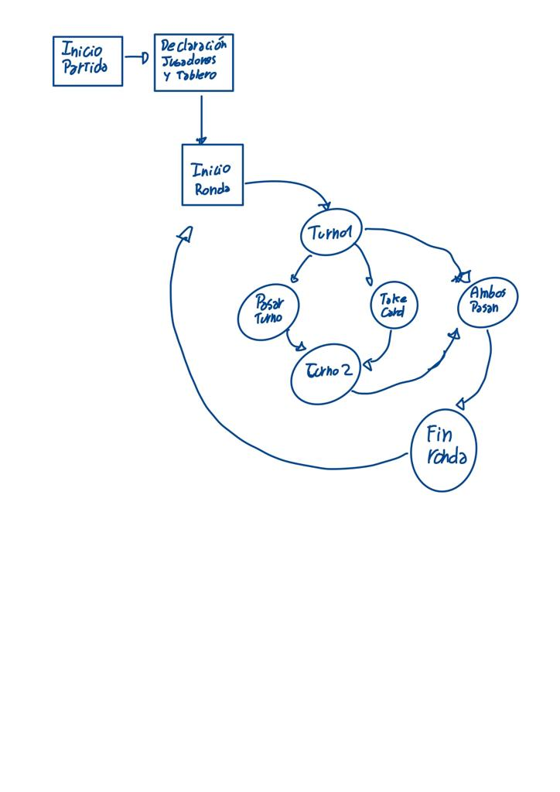

# Gwen't

This work is licensed under a
[Creative Commons Attribution 4.0 International License](http://creativecommons.org/licenses/by/4.0/)

Context
-------

This project's goal is to create a (simplified) clone of the
[_Gwent_](https://www.playgwent.com/en)card game developed by [_CD PROJEKT RED_](https://cdprojektred.com/en/)

---

# Gwen´t - Juego de Cartas en Scala

Es uhn juego por turnos en los que un jugador inicia su partida con 25 cartas en su mazo, estas mismas siendo creadas
usando un factory pattern, en donde la función genera, realiza todas las interacciones para poder settear los valores de forma 
rapida y comoda al ser llamado desde la clase deck que basa su uso en un ArrayBuffer.

Las cartas son se distribuyen tanto en en cartas de combate y cartas de clima, estas ultimas tienen una habilidad siempre que se invocan, 
pero las de combate pueden no tener una lo que se representa con la habilidad de tipo Sin()

Cada jugador tiene un tablero propio que determina su espacio de juego para cartas de tipo combate
, estos espacios son determinados por ArrayBuffers para cada subtipo de carta de combate .

En el caso de las cartas de clima son jugadas en un tablero que basicamente trabaja con los dos tableros propios (es un juego de dos jugadores)
y agrega un nuevo sitio para cartas que determina el uso de cartas de clima pues estas habilidades tienen efecto en ambos tableros del oponente.

Las cartas de clima son jugadas en orden y su efecto solo desaparece al settear las cartas a valores predeterminados o ingresar una carta de clima despejado

Como dato, la idea general de las rondas es que al finalizar se genere una carta de clima despejado para anular los efectos de las cartas y luego se setteen a vacio todas las listas de los tableros 

El GameController de esta version aun no ha sido implementado, de todas formas se adjunta al final un diagrama de estados de como se tenia la idea de ser ejecutado.

